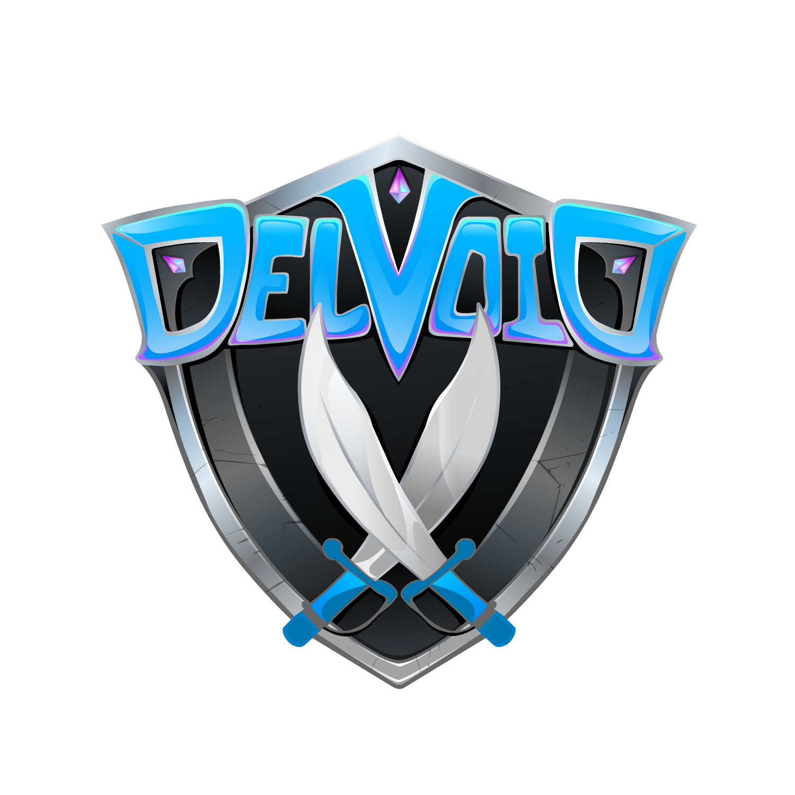
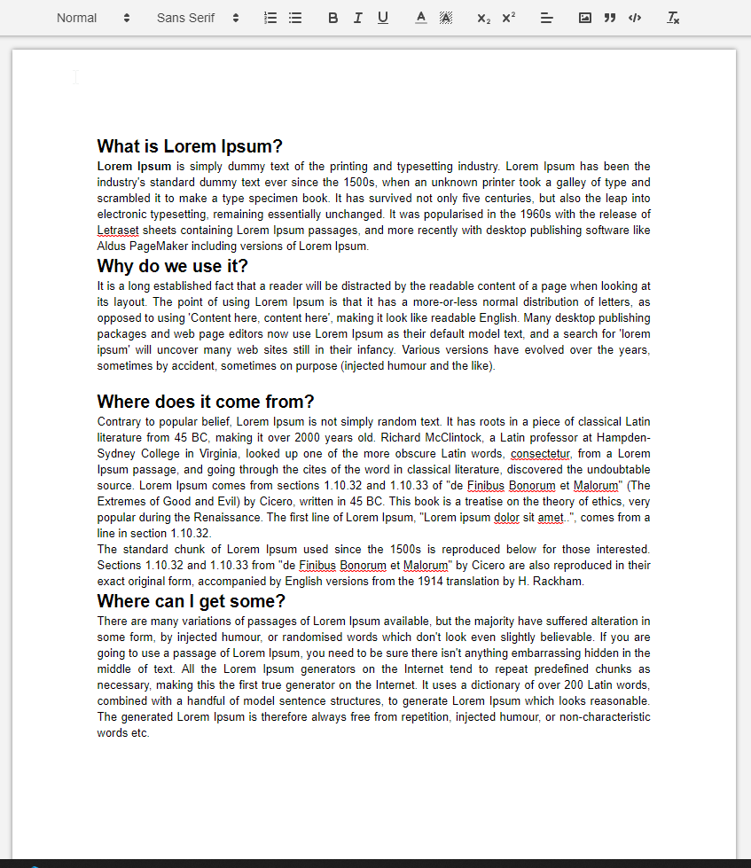

<div id="top"></div>

<!-- PROJECT LOGO -->
<br />
<div align="center">
  <a href="https://github.com/othneildrew/Best-README-Template">
    
  </a>

  <h3 align="center">Delv Docs</h3>

  <p align="center">
    A google docs clone
    <br />
    <br />
    <a href="https://delv-doc-clones.herokuapp.com/">View Demo</a>
    ·
    <a href="https://github.com/Delvoid/docs-clone/issues">Report Bug</a>
    ·
    <a href="https://github.com/Delvoid/docs-clone/issues">Request Feature</a>
  </p>
</div>

<!-- ABOUT THE PROJECT -->

## About The Project

<div align="center">



</div>
 
A google docs clone to collaborate with friends. Creates a unique URL to share your work with friends, or have them help in real time!

<p align="right">(<a href="#top">back to top</a>)</p>

### Built With

- [Node.js](https://nodejs.org/en/)
- [React.js](https://reactjs.org/)
- [Socket.io](https://socket.io/)
- [MongoDB](https://www.mongodb.com/)

<p align="right">(<a href="#top">back to top</a>)</p>

<!-- GETTING STARTED -->

## Getting Started

To get a local copy up and running follow these simple example steps.

### Prerequisites

- npm
  ```sh
  npm install npm@latest -g
  ```

### Installation

1. Clone the repo
   ```sh
   git clone https://github.com/Delvoid/docs-clone.git
   ```
2. Install NPM packages backend, in the root directory
   ```sh
   npm install
   ```
3. Install NPM packages client,
   ```sh
   cd client
   npm install
   ```
4. Start the server
   ```sh
   npm run dev
   ```
5. Start the client
   ```sh
   npm run client
   ```

<p align="right">(<a href="#top">back to top</a>)</p>

<!-- ROADMAP -->

## Roadmap

- [] Whos viewing
  - [] user auth
  - [] display whos viewing document
- [] Notify on user connection and user disconnect
- [] Private link
- [] Dark Mode
- [] Landing Page

See the [open issues](https://github.com/Delvoid/docs-clone/issues) for a full list of proposed features (and known issues).

<p align="right">(<a href="#top">back to top</a>)</p>

<!-- CONTRIBUTING -->

## Contributing

Contributions are what make the open source community such an amazing place to learn, inspire, and create. Any contributions you make are **greatly appreciated**.

If you have a suggestion that would make this better, please fork the repo and create a pull request. You can also simply open an issue with the tag "enhancement".
Don't forget to give the project a star! Thanks again!

1. Fork the Project
2. Create your Feature Branch (`git checkout -b feature/AmazingFeature`)
3. Commit your Changes (`git commit -m 'Add some AmazingFeature'`)
4. Push to the Branch (`git push origin feature/AmazingFeature`)
5. Open a Pull Request

<p align="right">(<a href="#top">back to top</a>)</p>

<!-- CONTACT -->

## Contact

Delvoid - [@delvoid](https://twitter.com/delvoid) - delvoid.dev@gmail.com

Project Link: [https://github.com/Delvoid/docs-clone](https://github.com/Delvoid/docs-clone)

<p align="right">(<a href="#top">back to top</a>)</p>
